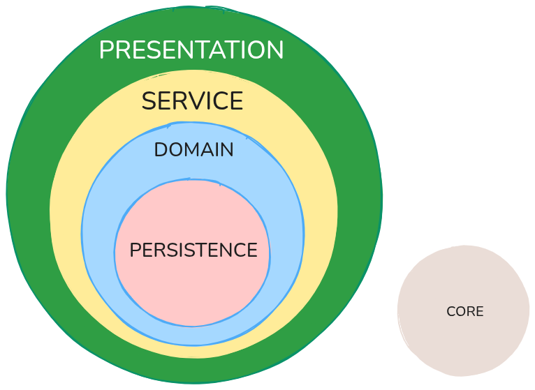

# Project Name


## 📌 Table of Contents

- [Description](#-description)
- [Architecture](#-architecture)
- [Features](#-features)
- [Installation](#-installation)
- [Usage](#-usage)
- [Documentation](#-documentation)
- [Contribution](#-contribution)
- [Contributors](#-contributors)
- [License](#-license)
- [Last Modification](#-last-modification)
- [Contact](#-contact)

## 📌 Description

This project is aim to make an API REST to be connected with the client and make a project for managing the core logic for ANDHARA

## 🏗️ Architecture

#### Layered Architecture: (presentation, service, domain, persistence, core)

- **Presentation**: endpoints and controllers to expose the information
- **Service**: all the business logic and complexity
- **Domain**: models and interfaces
- **Persistence**: repositories and database management
- **Core**: configurations



```txt
backend-andhara/
│── app/
│   ├── api/                      # (presentation layer)
│   │   ├── __init__.py
│   │   ├── products.py
│   │
│   ├── services/                 # (service or business logic layer)
│   │   ├── __init__.py
│   │   ├── product_service.py
│   │
│   ├── models/                   # (domain layer)
│   │   ├── __init__.py
│   │   ├── product.py
│   │
│   ├── persistence	          # (persistence layer)
│   │    ├── repositories/
│   │    │   ├── __init__.py
│   │    │   ├── product_repo.py
│   │    │
│   │    ├── db/
│   │       ├── __init__.py
│   │       ├── database.py
│   │
│   │── main.py                   # Entry point FastAPI
│── requirements.txt              # Dependencies
│── .env                          # Environment variables
│── README.md
```

## 🚀 Features

- 🛠️ Key feature 1
- 🔧 Key feature 2
- ⚡ Key feature 3

## 📦 Installation

### Prerequisites

- 🖥️ Dependency 1
- 💾 Dependency 2
- 🌐 Dependency 3

```sh
# Clone the repository
git clone https://github.com/andhara-tech/backend-andhara.git

# Enter the directory
cd backend-andhara

# Install dependencies
uv sync
```

## ▶️ Usage

```sh
uv run fastapi
```

## 📜 Documentation

For more details, check the [documentation](./documentation/README.md).

## 🤝 Contribution

1. Fork the repository
2. Create a branch for your feature: `git checkout -b feature/new-feature`
3. Make your changes and commit: `git commit -m 'Added new feature'`
4. Push your changes: `git push origin feature/new-feature`
5. Open a Pull Request

## 👥 Contributors

People who have contributed to this project:

<a href="https://github.com/andhara-tech/backend-andhara/graphs/contributors">
  
</a>

## 📄 License

This project is under the [Apache License 2.0](./LICENSE) license.

---

_This file was last updated on: `31/03/2025`_
